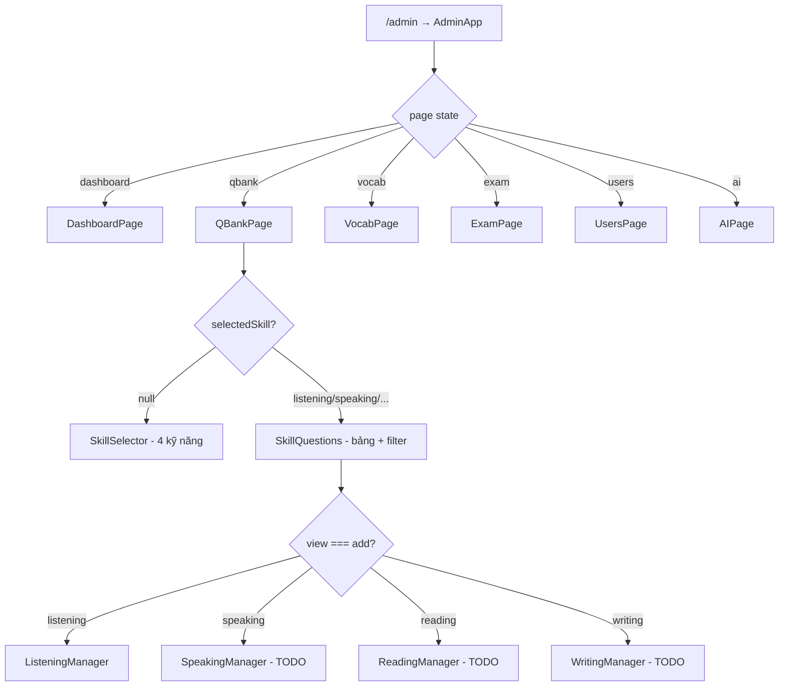
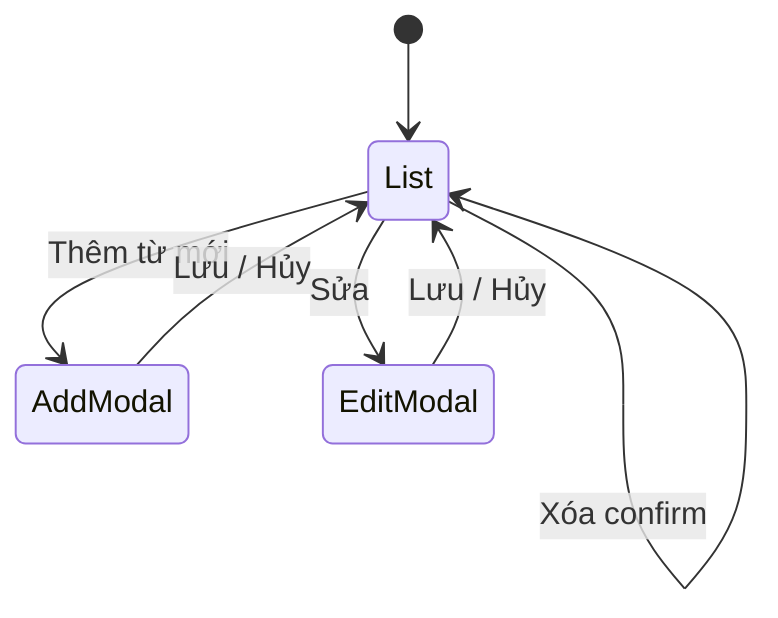

# TOEIC Master — Kế hoạch chi tiết Admin UI

> Tài liệu này dành cho **member làm giao diện** trong `toeic-web-app`.  
> Backend nằm ở repo **`toeic-backend-api`** (ngoài thư mục này) — phase hiện tại chỉ cần **mock data + UI**, Lead sẽ nối API sau.

**Chạy local:** `npm run dev` → mở `http://localhost:5173/admin`

---

## Mục lục

1. [Cấu trúc dự án `toeic-web-app`](#1-cấu-trúc-dự-án-toeic-web-app)
2. [Khác biệt so với React JSX “thuần”](#2-khác-biệt-so-với-react-jsx-thuần)
3. [Kiến trúc Admin — đọc kỹ](#3-kiến-trúc-admin--đọc-kỹ)
4. [Luồng điều hướng (navigation)](#4-luồng-điều-hướng-navigation)
5. [Quy ước CSS & component](#5-quy-ước-css--component)
6. [Mẫu tham chiếu: ListeningManager](#6-mẫu-tham-chiếu-listeningmanager)
7. [Ngân hàng câu hỏi (QBank) — tổng quan](#7-ngân-hàng-câu-hỏi-qbank--tổng-quan)
8. [Speaking — spec giao diện](#8-speaking--spec-giao-diện)
9. [Reading — spec giao diện](#9-reading--spec-giao-diện)
10. [Writing — spec giao diện](#10-writing--spec-giao-diện)
11. [Từ vựng (Vocab) — spec giao diện](#11-từ-vựng-vocab--spec-giao-diện)
12. [Các trang Lead / khác (tham khảo)](#12-các-trang-lead--khác-tham-khảo)
13. [Phân công & checklist](#13-phân-công--checklist)
14. [Git & PR](#14-git--pr)
15. [Definition of Done](#15-definition-of-done)

---

## 1. Cấu trúc dự án `toeic-web-app`

```
toeic-web-app/
├── docs/
│   ├── plan.md              ← bản tóm tắt phân công (cũ)
│   └── admin-ui-plan.md     ← TÀI LIỆU NÀY (chi tiết UI admin)
├── public/                  ← favicon, icons
├── index.html
├── package.json             ← Vite + React 18 + react-router-dom
├── vite.config.js
└── src/
    ├── main.jsx             ← entry: render App
    ├── App.jsx              ← chỉ bọc AppRouter
    ├── routes/
    │   └── AppRouter.jsx    ← /admin, /login, /register, ...
    ├── admin/               ← ★ PHẦN CHÍNH CỦA TEAM UI ★
    │   ├── AdminApp.jsx
    │   ├── components/
    │   ├── pages/
    │   └── styles/
    ├── constants/
    │   └── admin.js         ← menu sidebar, tiêu đề trang
    ├── pages/auth/          ← Login (Lead)
    ├── services/            ← axios/API (Lead nối sau)
    ├── contexts/, hooks/, store/  ← auth Redux (Lead)
    ├── styles/              ← CSS trang auth (không dùng cho admin form)
    └── utils/
```

**Phạm vi member:** gần như **chỉ sửa trong `src/admin/`** (+ vài dòng trong `QBankPage.jsx` khi nối Manager mới).

---

## 2. Khác biệt so với React JSX “thuần”

| Thói quen cũ (CRA / JSX thuần) | Dự án này |
|--------------------------------|-----------|
| `import './Component.css'` | CSS export **chuỗi** từ file `*.css.js`, inject bằng `<style>{CSS}</style>` |
| Route mỗi trang admin (`/admin/vocab`) | **Một route** `/admin`; đổi trang bằng `useState('vocab')` trong `AdminApp` |
| Styled-components / Tailwind | **Class name thuần** + biến CSS trong `global.css.js` |
| Tách `components/` toàn app | Admin có folder riêng `src/admin/` — không trộn với auth |
| Gọi API ngay trong form | Phase 1: `useState` + `console.log` / `alert`; comment `// TODO: xxxService` |

**Stack:** Vite, React 18, React Router (chỉ cho auth + `/admin`), Lucide icons (`lucide-react`), không TypeScript.

---

## 3. Kiến trúc Admin — đọc kỹ

```
src/admin/
├── AdminApp.jsx                 # Shell: Sidebar + Header + đổi page
├── styles/
│   └── global.css.js            # Layout chung — CHỈ LEAD sửa
├── components/
│   ├── Sidebar.jsx              # Menu từ constants/admin.js
│   ├── Header.jsx               # Tiêu đề, dark mode, thông báo
│   ├── SharedUI.jsx             # Bar, ProgressItem (Dashboard)
│   ├── ListeningManager.jsx     # ★ MẪU HOÀN CHỈNH — LEAD
│   ├── ListeningManager.css.js
│   ├── SpeakingManager.jsx      # TODO — Member 1
│   ├── ReadingManager.jsx       # TODO — Member 2
│   └── WritingManager.jsx       # TODO — Member 3
└── pages/
    ├── DashboardPage.jsx        # Lead — đã có shell
    ├── QBankPage.jsx            # 3 màn: chọn skill → list → add (Listening OK)
    ├── VocabPage.jsx            # Shell list — Member 4 hoàn thiện
    ├── ExamPage.jsx             # Lead
    ├── UsersPage.jsx            # Lead
    └── AIPage.jsx               # Lead
```

### 3.1. `AdminApp.jsx` — “router nội bộ”

```jsx
const PAGES = {
  dashboard: DashboardPage,
  qbank: QBankPage,
  vocab: VocabPage,
  exam: ExamPage,
  users: UsersPage,
  ai: AIPage,
};
// page state: "dashboard" | "qbank" | "vocab" | ...
```

- `Sidebar` gọi `setPage(id)` — `id` khớp key trong `PAGES` và `NAV` (`src/constants/admin.js`).
- **Member không thêm menu mới** trừ khi Lead cập nhật `admin.js` + `AdminApp.jsx`.

### 3.2. Hai lớp “điều hướng” trong QBank

`QBankPage.jsx` có **state riêng**, không dùng React Router:

```
Level 1: selectedSkill = null     → SkillSelector (4 ô Listening/Speaking/...)
Level 2: selectedSkill = "speaking" → SkillQuestions
Level 3: view = "add"             → SpeakingManager (member tạo)
```

Member Speaking/Reading/Writing chỉ cần:
1. Tạo `[Skill]Manager.jsx`
2. Trong `SkillQuestions`, thêm nhánh `if (skillId === "speaking" && view === "add")`
3. Nút **Thêm câu hỏi** gọi `setView("add")` thay vì `alert(...)`

### 3.3. Class CSS dùng chung (từ `global.css.js`)

Dùng được **không cần import** (đã inject ở `AdminApp`):

| Class | Mục đích |
|-------|----------|
| `page-enter` | Animation vào trang |
| `page-header`, `page-title`, `page-subtitle` | Tiêu đề trang list |
| `card`, `card-header` | Khối nội dung có viền |
| `toolbar`, `toolbar-search` | Thanh tìm + filter |
| `btn`, `btn-primary`, `btn-secondary` | Nút |
| `table-wrapper`, `table`, `badge` | Bảng danh sách QBank |
| `stat-card`, `stat-grid` | Thẻ thống kê Part |
| `vocab-grid`, `vocab-card`, ... | **Vocab list hiện tại** (Member 4 nên tách sang `VocabPage.css.js` dần) |

Form **thêm câu hỏi** (Manager) dùng class **prefix riêng** (`lm-`, `sm-`, ...) trong file `*Manager.css.js`.

---

## 4. Luồng điều hướng (navigation)



**Self-test bắt buộc:** Admin → Ngân hàng câu hỏi → chọn skill → Thêm câu hỏi → Quay lại → Quay lại skill → về 4 ô.

---

## 5. Quy ước CSS & component

### 5.1. Ai sửa file nào

| File | Quyền |
|------|--------|
| `admin/styles/global.css.js` | **Lead only** — sidebar, header, bảng, nút, vocab grid mặc định |
| `admin/components/[Skill]Manager.css.js` | **Owner skill** — toàn bộ form + preview |
| `admin/pages/VocabPage.css.js` | **Member Vocab** (tạo mới) |

**Không** copy style form Manager vào `global.css.js`.

### 5.2. Prefix class (tránh đè CSS)

| Module | Prefix | File JSX | File CSS |
|--------|--------|----------|----------|
| Listening | `lm-` | `ListeningManager.jsx` | `ListeningManager.css.js` |
| Speaking | `sm-` | `SpeakingManager.jsx` | `SpeakingManager.css.js` |
| Reading | `rm-` | `ReadingManager.jsx` | `ReadingManager.css.js` |
| Writing | `wm-` | `WritingManager.jsx` | `WritingManager.css.js` |
| Vocab | `vp-` | `VocabPage.jsx` | `VocabPage.css.js` |

### 5.3. Template bọc component Manager

```jsx
import { useState } from "react";
import { ChevronLeft } from "lucide-react";
import SKILL_CSS from "./SpeakingManager.css.js";

export default function SpeakingManager({ onBack }) {
  const [tab, setTab] = useState("readAloud");

  return (
    <>
      <style>{SKILL_CSS}</style>
      <div className="sm-wrap page-enter">
        <div className="sm-top-panel">...</div>
        <div className="sm-tabs-panel">...</div>
        <div className="sm-content-panel">...</div>
      </div>
    </>
  );
}
```

Copy cấu trúc panel từ `ListeningManager.css.js` (đổi `lm-` → `sm-`).

### 5.4. Màu & theme

Admin dùng biến trong `global.css.js` (light/dark qua `data-theme` trên `<html>`):

```css
--or1 / --accent: #FF6B35;
--bg, --bg-secondary: nền kem/trắng;
--border: rgba(255, 107, 53, 0.22);
```

Mỗi skill trong QBank có màu riêng (đã set trong `QBankPage`): Listening xanh dương, Speaking xanh lá, Writing cam, Reading tím.

### 5.5. Icons

```jsx
import { Mic, Upload, Plus } from "lucide-react";
// <Mic size={15} />
```

---

## 6. Mẫu tham chiếu: ListeningManager

**Đường dẫn:** `src/admin/components/ListeningManager.jsx`

### 6.1. Cấu trúc layout (bắt chước 100%)

```
sm-wrap (hoặc lm-wrap)
├── sm-top-panel
│   └── nút Quay lại + title + subtitle
├── sm-tabs-panel (nếu skill có nhiều loại câu)
│   └── sm-tab × N
└── sm-content-panel
    └── sm-two-col (tuỳ chọn)
        ├── sm-card (form trái)
        │   └── sm-section × nhiều
        │       ├── sm-section-title
        │       └── sm-form-group, sm-input, sm-select, ...
        └── sm-preview (cột phải — mock UI thi thật)
```

### 6.2. Tab Listening (gợi ý cho skill khác)

| Tab | Nội dung |
|-----|----------|
| `single` | Part 1–2: 1 câu, 4 đáp án, audio/ảnh |
| `group` | Part 3–4: nhiều nhóm, mỗi nhóm nhiều câu con |

Speaking/Reading/Writing: chia tab theo **Part hoặc loại đề**, không nhét hết vào một form dài.

### 6.3. Section gợi ý (Listening)

1. **Thông tin chung** — Part, độ khó  
2. **Tài liệu đính kèm** — upload ảnh/audio (UI kéo thả, chưa cần upload thật)  
3. **Nội dung câu hỏi** — textarea + 4 option + chọn đáp án  
4. **Giải thích** — EN + VI, nút “AI gợi ý” (mock `setTimeout`)  
5. **Preview** — khung giống màn hình thi  

### 6.4. Nối vào QBank (mẫu code)

Trong `SkillQuestions` (`QBankPage.jsx`):

```jsx
import SpeakingManager from "../components/SpeakingManager.jsx";

// Sau const [view, setView] = useState("list");
if (skillId === "speaking" && view === "add") {
  return <SpeakingManager onBack={() => setView("list")} />;
}

// Nút Thêm câu hỏi — trong onClick:
if (skillId === "speaking") setView("add");
```

**Lưu ý conflict:** nhiều người sửa `QBankPage.jsx` → chia theo skill hoặc merge tuần tự, báo Lead trước.

---

## 7. Ngân hàng câu hỏi (QBank) — tổng quan

### 7.1. Màn 1 — Chọn kỹ năng (`SkillSelector`)

- 4 card: Listening, Speaking, Writing, Reading  
- Click → `setSelectedSkill(id)`  
- **Không cần sửa** trừ khi đổi copy/số liệu mock  

### 7.2. Màn 2 — Danh sách (`SkillQuestions`)

Đã có sẵn cho **cả 4 skill** (mock `SKILL_DATA`):

- Header: Quay lại, tên skill, nút Nhập Excel / **Thêm câu hỏi**  
- Hàng `stat-card` theo Part  
- Bảng: ID, Part, Loại, Nội dung, Độ khó, Trạng thái, Sửa/Xóa  

**Listening:** nút Thêm → `ListeningManager`  
**Còn lại:** hiện `alert` — member thay bằng Manager của mình  

### 7.3. Mock data

Toàn bộ `SKILL_DATA` nằm **đầu file** `QBankPage.jsx`. Member có thể thêm dòng mock để test bảng; không bắt buộc đồng bộ với form Manager.

---

## 8. Speaking — spec giao diện

**Owner:** Member 1  
**Files:** `SpeakingManager.jsx`, `SpeakingManager.css.js`, sửa `QBankPage.jsx`

### 8.1. Tab đề xuất

| Tab `id` | Tên UI | Loại câu TOEIC Speaking |
|----------|--------|-------------------------|
| `readAloud` | Đọc to (Q1–2) | Đoạn văn + thời gian đọc |
| `describe` | Mô tả tranh (Q3–4) | Ảnh + gợi ý từ khóa |
| `respond` | Trả lời câu hỏi (Q5–7) | Câu hỏi + prep time / response time |
| `info` | Trả lời theo thông tin (Q8–10) | Bảng/chart mock + 2–3 câu hỏi con |

Có thể gộp 4 tab thành 2 tab đầu tiên nếu chưa kịp — ưu tiên **có khung section rõ**, không cần đủ logic.

### 8.2. Field theo tab (mock)

**Chung mọi tab:**
- Độ khó (Dễ / Trung bình / Khó)  
- Trạng thái (Draft / Active) — `select`  
- Nút Lưu / Reset — `console.log(payload)` + `alert`  

**readAloud:**
- Textarea: đoạn cần đọc  
- Số giây chuẩn bị / đọc (input number)  
- Upload audio mẫu (optional UI)  

**describe:**
- Upload ảnh (khung `sm-upload`)  
- Textarea: gợi ý chấm / sample answer  
- Preview: ảnh + timer giả (vd. `00:45`)  

**respond / info:**
- Textarea câu hỏi  
- Với `info`: repeater 2–3 “câu hỏi con” (copy pattern `lm-sub-q` từ Listening Part 3–4)  

### 8.3. Cột Preview (phải có)

Khung card cố định bên phải:

```
┌─────────────────────────┐
│  SPEAKING PREVIEW       │
│  [Part badge]           │
│  ┌─────────────────┐    │
│  │  ảnh / text     │    │
│  └─────────────────┘    │
│  ⏱ Prep: 30s | Answer: 60s │
│  [ Nút Record giả ]     │
└─────────────────────────┘
```

### 8.4. Wireframe tổng thể

```
[ ← Quay lại ]  Thêm câu hỏi Speaking
─────────────────────────────────────
[ Tab1 ] [ Tab2 ] [ Tab3 ] [ Tab4 ]
─────────────────────────────────────
|  FORM (card + sections)  | PREVIEW |
|                          |         |
[ Reset ]  [ Lưu câu hỏi ]           |
```

---

## 9. Reading — spec giao diện

**Owner:** Member 2  
**Files:** `ReadingManager.jsx`, `ReadingManager.css.js`, sửa `QBankPage.jsx`

### 9.1. Tab đề xuất

| Tab | Part | Đặc thù UI |
|-----|------|------------|
| `p5` | Part 5 | 1 câu, không passage dài — giống Listening single |
| `p6` | Part 6 | Passage textarea + 4 câu điền chỗ trống (có thể 2–4 câu con) |
| `p7` | Part 7 | Passage dài hơn + 2–5 câu MCQ |

### 9.2. Field Part 5

- Câu hỏi (có chỗ trống `_____` trong text)  
- 4 đáp án A–D + radio đáp án đúng  
- Giải thích EN/VI (textarea)  
- Preview: hiển thị câu + highlight đáp án chọn  

### 9.3. Field Part 6–7

- **Passage** (textarea lớn, min-height ~160px)  
- Khối “Câu hỏi con” lặp được (copy `GroupQuestionForm` Listening):  
  - Nội dung câu hỏi  
  - 4 đáp án  
  - Nút “+ Thêm câu hỏi con”  
- Part 7 có thể thêm upload ảnh biểu đồ (optional)  

### 9.4. Preview

- Trái passage scroll  
- Dưới là từng câu MCQ  
- Badge Part 5 / 6 / 7  

---

## 10. Writing — spec giao diện

**Owner:** Member 3  
**Files:** `WritingManager.jsx`, `WritingManager.css.js`, sửa `QBankPage.jsx`

### 10.1. Tab đề xuất

| Tab | Loại | UI chính |
|-----|------|----------|
| `sentence` | Q1–5 Viết câu | Ảnh + 2 từ bắt buộc + ô ví dụ câu mẫu |
| `email` | Q6–7 Email | Đề email (textarea) + checklist câu hỏi cần trả lời |
| `opinion` | Q8 Opinion | Đề bài + gợi ý outline + rubric chấm |

### 10.2. Field chi tiết

**sentence:**
- Upload ảnh  
- Input: word1, word2  
- Textarea: đề / hướng dẫn  
- Textarea: câu mẫu (answer key)  

**email:**
- Textarea: nội dung email nhận được  
- Textarea: yêu cầu đề (tiếng Anh)  
- Số từ gợi ý min/max  

**opinion:**
- Textarea đề  
- Textarea rubric (bullet: grammar, vocabulary, organization)  
- Preview: khung “bài làm học viên” (textarea readonly disabled)  

### 10.3. Màu skill

Dùng `--orange` / `var(--orange-soft)` cho nút primary trong preview (đồng bộ card Writing ở QBank).

---

## 11. Từ vựng (Vocab) — spec giao diện

**Owner:** Member 4  
**File hiện tại:** `pages/VocabPage.jsx` (shell có list, chưa có form/modal)

### 11.1. Trạng thái hiện tại

- Header + nút “Thêm từ mới” (chưa `onClick`)  
- Toolbar tìm kiếm + filter chủ đề (nút chưa logic)  
- Grid 3 cột dùng class `vocab-*` từ **global** (nên migrate dần sang `vp-*` trong `VocabPage.css.js`)  

### 11.2. Luồng UI cần làm



### 11.3. Màn danh sách (nâng cấp)

- State `words` → `useState([...])` có thể thêm/sửa/xóa  
- Filter: `search`, `topic`, `level` (client-side filter là đủ)  
- Mỗi card hiển thị: `word`, `pos`, `meaning`, `level` (1–5 dots), topic tag  

### 11.4. Modal thêm/sửa (trong `VocabPage.jsx`)

Overlay + card giữa màn (`vp-modal`, `vp-modal-card`):

| Field | Kiểu |
|-------|------|
| Từ (EN) | input text |
| Loại từ (POS) | select: noun, verb, adj, adv, ... |
| Nghĩa (VI) | textarea |
| Cấp độ | 1–5 (radio hoặc select) |
| Chủ đề | select: Business, Office, Travel, ... |
| Ví dụ câu | textarea (optional) |
| Ghi chú | textarea (optional) |

Nút: **Hủy** | **Lưu** → cập nhật state, đóng modal.

### 11.5. Xóa

`window.confirm('Xóa từ "negotiate"?')` → filter khỏi mảng.

### 11.6. Không sửa

- `AdminApp.jsx`, `Sidebar.jsx`  
- `global.css.js` trừ khi Lead yêu cầu thêm 1 class dùng chung  

---

## 12. Các trang Lead / khác (tham khảo)

| Trang | File | Ghi chú cho member |
|-------|------|---------------------|
| Dashboard | `DashboardPage.jsx` | Tham khảo `stat-grid`, `card`, `SharedUI` |
| Đề thi | `ExamPage.jsx` | Layout card danh sách đề — tương tự list QBank |
| Users | `UsersPage.jsx` | Bảng user |
| AI Config | `AIPage.jsx` | Form cấu hình — sau này có thể tái dùng pattern “section” |

Member **không** cần làm các trang này trong phase hiện tại.

---

## 13. Phân công & checklist

### Member 1 — Speaking

- [ ] Copy `ListeningManager.*` → `SpeakingManager.*`, đổi prefix `sm-`
- [ ] 2–4 tab theo mục [8](#8-speaking--spec-giao-diện)
- [ ] Cột preview Speaking
- [ ] Nối `QBankPage`: `speaking` + `view === "add"`
- [ ] `npm run build` pass

### Member 2 — Reading

- [ ] `ReadingManager` + `rm-`
- [ ] Tab P5 / P6 / P7
- [ ] Passage + câu con cho P6–P7
- [ ] Nối QBank `reading`
- [ ] Build pass

### Member 3 — Writing

- [ ] `WritingManager` + `wm-`
- [ ] Tab sentence / email / opinion
- [ ] Rubric + preview bài làm
- [ ] Nối QBank `writing`
- [ ] Build pass

### Member 4 — Vocab

- [ ] Tạo `VocabPage.css.js` (`vp-`)
- [ ] Modal thêm/sửa + state CRUD mock
- [ ] Filter search/topic hoạt động
- [ ] Xóa có confirm
- [ ] Build pass

### Lead

- [x] ListeningManager (mẫu)
- [ ] Dashboard, Exam, Users, AI — hoàn thiện + API
- [ ] Review PR, giải quyết conflict `QBankPage.jsx`
- [ ] Sau UI: `services/*` ↔ `toeic-backend-api`

---

## 14. Git & PR

1. `git pull origin develop` (hoặc branch chính nhóm)
2. Branch: `feature/speaking-manager`, `feature/vocab-crud`, ...
3. **1 module = 1 PR** — screenshot luồng Admin → module → Quay lại
4. Không commit `.env`, không đổi `package.json` nếu Lead chưa duyệt
5. Chạy trước khi PR: `npm run build` và `npm run lint` (nếu có rule mới)

---

## 15. Definition of Done

Một task UI được coi là **xong** khi:

1. Có **khung** rõ: `top-panel`, `tabs` (nếu cần), `card`, `section` — không để input trôi trên nền trắng không viền  
2. Nút **Quay lại** hoạt động (QBank) hoặc đóng modal (Vocab)  
3. Lưu mock in payload ra `console` hoặc cập nhật `useState`  
4. `npm run build` không lỗi  
5. PR có 1–2 screenshot + mô tả ngắn  

---

## Phụ lục A — Map file nhanh

| Muốn làm gì | Mở file |
|-------------|---------|
| Đổi menu trái | `src/constants/admin.js` + `Sidebar.jsx` (Lead) |
| Đổi trang admin | `AdminApp.jsx` (Lead) |
| Thêm form câu hỏi skill | `components/[Skill]Manager.jsx` |
| Danh sách câu theo skill | `pages/QBankPage.jsx` |
| Từ vựng | `pages/VocabPage.jsx` |
| Style chung admin | `styles/global.css.js` (Lead) |
| Mẫu form đẹp | `components/ListeningManager.jsx` |

## Phụ lục B — Liên kết backend (sau này)

Khi API sẵn sàng, Lead sẽ thêm service kiểu:

```js
// TODO ví dụ — chưa cần member làm
// import { createSpeakingQuestion } from '../../services/speakingService.js';
// await createSpeakingQuestion(payload);
```

Member chỉ cần giữ **shape payload** ổn định (part, difficulty, question, options, ...) để dễ map sang API.

---

*Tài liệu cập nhật theo codebase `toeic-web-app` — cấu trúc `src/admin/` tháng 5/2026.*
