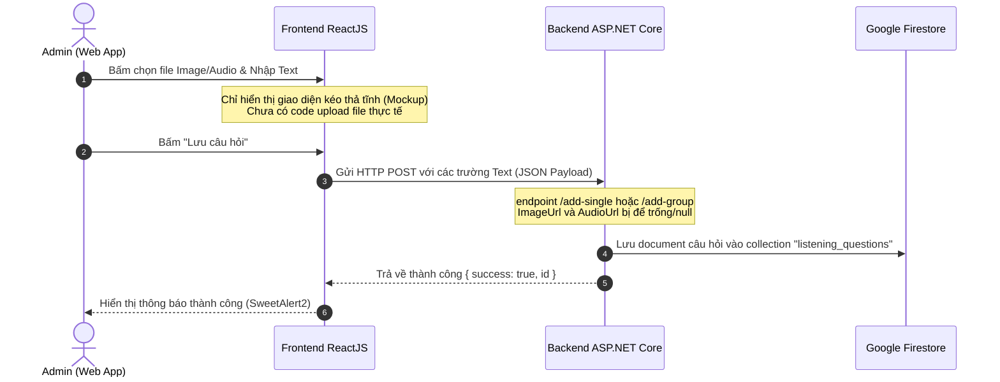

# Hướng dẫn Luồng Upload File (Audio/Image) cho Ngân hàng Câu hỏi

Tài liệu này giải thích chi tiết về luồng hoạt động hiện tại của chức năng **Thêm câu hỏi** trong phân hệ **Listening Ngân hàng Câu hỏi**, phân tích cách lưu trữ file âm thanh/hình ảnh, đồng thời hướng dẫn chi tiết cách tích hợp **Cloudinary** để tối ưu hóa lưu trữ và truyền tải.

---

## 1. Luồng Hoạt động Hiện tại & Hiện trạng Lưu trữ

### 💡 Luồng hoạt động hiện tại (Under the hood)
Hiện tại, khi Admin thực hiện thêm câu hỏi Listening:



### 📁 Hiện trạng lưu trữ file Audio và Image
* **Cực kỳ quan trọng:** Ở giao diện `ListeningManager.jsx`, vùng chọn file ảnh/âm thanh hiện đang là **Mockup giao diện tĩnh**. Khi bấm lưu, dữ liệu file chưa được đọc, chưa được upload lên bất cứ đâu và backend cũng chưa nhận được file.
* **Cách thức lưu trong Firestore:** Trong cơ sở dữ liệu Firestore, các thực thể câu hỏi (`ListeningQuestion` và `QuestionGroup`) đã có sẵn hai trường là **`image_url`** và **`audio_url`** dưới dạng `string`. Khi học viên làm bài, ứng dụng mobile/web sẽ đọc các chuỗi URL này và tải file trực tuyến về để phát nhạc hoặc hiển thị ảnh.

---

## 2. Đánh giá giải pháp sử dụng Cloudinary

**Cloudinary là một giải pháp CỰC KỲ TỐT, HIỆN ĐẠI và RẤT NÊN DÙNG** cho dự án TOEIC Master vì các lý do sau:

### ✅ Ưu điểm vượt trội:
1. **Hỗ trợ CDN toàn cầu siêu tốc:** File audio phát tức thì, ảnh load cực nhanh, không lo giật lag cho học viên.
2. **Gói Free hào phóng:** Cloudinary cung cấp miễn phí **25 Monthly Credits** (tương đương khoảng **25 GB** dung lượng lưu trữ kết hợp băng thông truyền tải hàng tháng). Mức này cực kỳ dư dả cho dự án học tập/quản trị quy mô vừa và nhỏ.
3. **Tự động tối ưu dung lượng:**
   * Tự động nén ảnh sang định dạng WebP hoặc AVIF (giảm 70% dung lượng mà không suy hao chất lượng).
   * Tự động nén file âm thanh MP3 để tối ưu hóa tốc độ tải khi chạy audio.

---

## 3. Kiến trúc Đề xuất Tích hợp Cloudinary

Có 2 phương án để tích hợp Cloudinary vào dự án. Dưới đây là so sánh chi tiết:

| Tiêu chí | Phương án 1: Client-Side Upload (Unsigned) <br/>*(Khuyên dùng)* | Phương án 2: Server-Side Upload <br/>*(Qua Backend API)* |
| :--- | :--- | :--- |
| **Cách thức** | Frontend ReactJS tải trực tiếp file lên Cloudinary, lấy về URL rồi gửi URL đó sang Backend. | Frontend gửi file lên C# Backend API dưới dạng `MultipartFormData`, Backend gọi Cloudinary SDK để upload. |
| **Băng thông** | **Tối ưu:** File đi thẳng từ máy Admin lên Cloudinary. Server Backend hoàn toàn rảnh tay. | **Tốn băng thông:** File phải đi qua API Server trước khi lên Cloudinary, tăng tải CPU/RAM cho server. |
| **Độ phức tạp** | **Thấp:** Chỉ cần cài đặt và gọi 1 hàm Fetch/Axios đơn giản ở frontend. | **Trung bình:** Cần cài đặt thư viện NuGet CloudinaryDotNet ở backend và cấu hình API. |
| **Bảo mật** | **Đủ dùng:** Sử dụng "Unsigned Upload Preset" giới hạn quyền ghi của client. | **Cao nhất:** API Key/Secret được giấu kín hoàn toàn ở phía server. |

> [!TIP]
> **Khuyên dùng Phương án 1 (Client-Side Upload)** vì nó giúp giảm tải tối đa cho máy chủ backend, lập trình đơn giản, nhanh chóng và hoạt động độc lập với API Server.

---

## 4. Hướng dẫn Từng bước Triển khai Cloudinary (Unsigned Client Upload)

### Bước 1: Thiết lập Tài khoản Cloudinary
1. Đăng ký tài khoản miễn phí tại [Cloudinary](https://cloudinary.com).
2. Vào **Dashboard** để lấy tên vùng lưu trữ: `Cloud Name` (ví dụ: `toeicmaster`).
3. Vào **Settings** ⚙️ ➔ **Upload** ➔ Cuộn xuống mục **Upload presets** ➔ Chọn **Add upload preset**.
4. Thiết lập cấu hình:
   * **Upload preset name:** Đặt tên gợi nhớ, ví dụ: `toeic_qbank_preset`.
   * **Signing Mode:** Chuyển từ *Signed* sang **`Unsigned`** (để cho phép client ReactJS tự động tải lên không cần key bí mật).
   * **Folder:** Đặt thư mục lưu trữ, ví dụ: `toeic_questions`.
   * Bấm **Save** để lưu lại.

---

### Bước 2: Triển khai Code Frontend (ReactJS)

Chúng ta sẽ nâng cấp chức năng upload file trực tiếp tại frontend `ListeningManager.jsx`. Dưới đây là code mẫu chi tiết:

```javascript
// toeic-web-app/src/utils/cloudinary.js
const CLOUD_NAME = "tên_cloud_name_của_bạn"; // Thay bằng Cloud Name thực tế
const UPLOAD_PRESET = "toeic_qbank_preset"; // Thay bằng Preset đã tạo ở Bước 1

/**
 * Tải file lên Cloudinary trực tiếp từ Client
 * @param {File} file - Đối tượng File từ ô input
 * @param {string} resourceType - Kiểu tài nguyên: 'image' hoặc 'video' (audio dùng chung 'video')
 * @returns {Promise<string>} - Trả về URL của file sau khi upload thành công
 */
export const uploadToCloudinary = async (file, resourceType = "auto") => {
  if (!file) return null;

  const formData = new FormData();
  formData.append("file", file);
  formData.append("upload_preset", UPLOAD_PRESET);

  try {
    const response = await fetch(
      `https://api.cloudinary.com/v1_1/${CLOUD_NAME}/${resourceType}/upload`,
      {
        method: "POST",
        body: formData,
      }
    );

    if (!response.ok) {
      throw new Error("Không thể tải file lên Cloudinary");
    }

    const data = await response.json();
    return data.secure_url; // Đây là đường dẫn HTTPS lưu vào database
  } catch (error) {
    console.error("Cloudinary Upload Error:", error);
    throw error;
  }
};
```

#### Tích hợp vào sự kiện Lưu câu hỏi (`handleSave`):

```javascript
// Mẫu tích hợp trong ListeningManager.jsx
const [imageFile, setImageFile] = useState(null);
const [audioFile, setAudioFile] = useState(null);
const [uploading, setUploading] = useState(false);

const handleSave = async () => {
  setUploading(true);
  try {
    let imageUrl = "";
    let audioUrl = "";

    // 1. Tải ảnh lên Cloudinary nếu có (Part 1)
    if (part === "1" && imageFile) {
      imageUrl = await uploadToCloudinary(imageFile, "image");
    }

    // 2. Tải audio lên Cloudinary nếu có
    if (audioFile) {
      // Lưu ý: Đối với file Audio, Cloudinary phân loại vào resource_type là 'video'
      audioUrl = await uploadToCloudinary(audioFile, "video");
    }

    // 3. Chuẩn bị payload gửi lên Backend
    const payload = {
      part: parseInt(part, 10),
      difficulty: "medium",
      questionText: question,
      options: options,
      correctAnswer: selectedAnswer,
      imageUrl: imageUrl, // Đã có link online!
      audioUrl: audioUrl, // Đã có link online!
      explanationVi: explanationVi,
    };

    // 4. Gọi API lưu vào Firestore
    const res = await fetch("http://localhost:5133/api/listening/admin/add-single", {
      method: "POST",
      headers: { "Content-Type": "application/json" },
      body: JSON.stringify(payload)
    });
    
    // Xử lý thông báo thành công...
  } catch (err) {
    alert("Lỗi upload hoặc lưu dữ liệu!");
  } finally {
    setUploading(false);
  }
};
```

---

### Bước 3: Triển khai Code Backend C# (Nếu muốn đi theo Phương án 2)

Nếu bạn muốn backend xử lý toàn bộ file để tăng tính bảo mật, bạn cài đặt package NuGet `CloudinaryDotNet` vào project `ToeicBackend.Infrastructure`:

```bash
dotnet add package CloudinaryDotNet
```

Cấu hình dịch vụ trong file `appsettings.json`:
```json
{
  "Cloudinary": {
    "CloudName": "your_cloud_name",
    "ApiKey": "your_api_key",
    "ApiSecret": "your_api_secret"
  }
}
```

Viết service upload file ở backend:
```csharp
using CloudinaryDotNet;
using CloudinaryDotNet.Actions;
using Microsoft.Extensions.Options;

public class CloudinaryService : IUploadService
{
    private readonly Cloudinary _cloudinary;

    public CloudinaryService(IOptions<CloudinarySettings> config)
    {
        var acc = new Account(
            config.Value.CloudName,
            config.Value.ApiKey,
            config.Value.ApiSecret
        );
        _cloudinary = new Cloudinary(acc);
    }

    public async Task<string> UploadImageAsync(Stream fileStream, string fileName)
    {
        var uploadParams = new ImageUploadParams()
        {
            File = new FileDescription(fileName, fileStream),
            Folder = "toeic_images"
        };
        var uploadResult = await _cloudinary.UploadAsync(uploadParams);
        return uploadResult.SecureUrl.ToString();
    }

    public async Task<string> UploadAudioAsync(Stream fileStream, string fileName)
    {
        var uploadParams = new VideoUploadParams() // Audio trong Cloudinary dùng VideoUploadParams
        {
            File = new FileDescription(fileName, fileStream),
            Folder = "toeic_audios"
        };
        var uploadResult = await _cloudinary.UploadAsync(uploadParams);
        return uploadResult.SecureUrl.ToString();
    }
}
```

---

## 5. Tổng kết Hành động tiếp theo cho dự án

> [!NOTE]
> Để hoàn thiện chức năng QBank trong các phiên làm việc sau, chúng ta cần:
> 1. Thiết lập tài khoản Cloudinary và lấy thông tin cấu hình Unsigned Upload.
> 2. Chuyển đổi các vùng drag-and-drop trong `ListeningManager.jsx` từ thẻ tĩnh thành thẻ `<input type="file" accept="image/*,audio/*" />` ẩn, kích hoạt sự kiện click của người dùng.
> 3. Tích hợp module `uploadToCloudinary` ở frontend để tự động upload ảnh/audio trước khi gọi API lưu câu hỏi.
